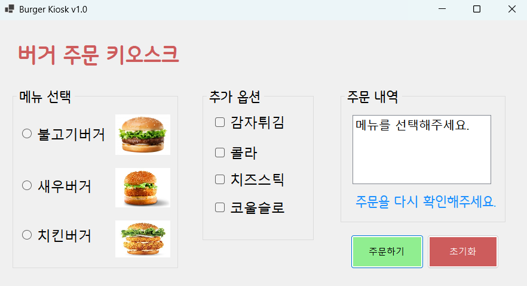
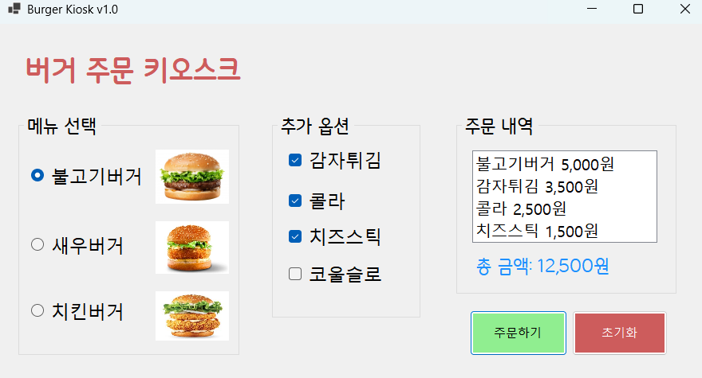
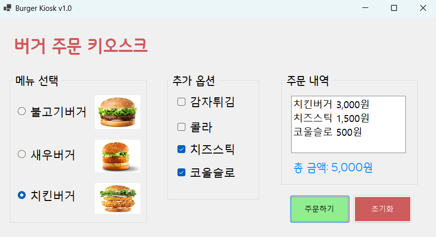
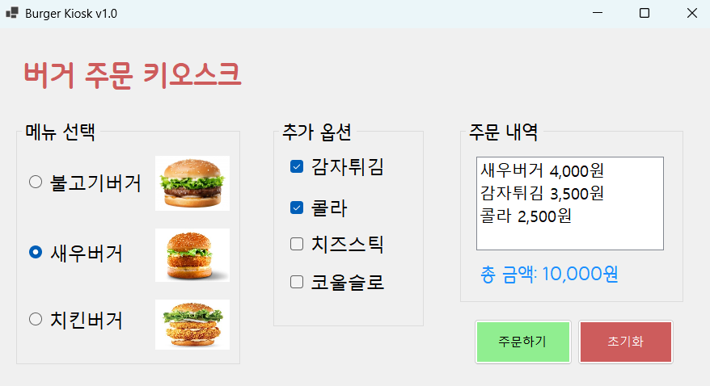

# [C# 코딩] 나의 키오스크 만들기

## 개요
- C# 프로그래밍 학습
- 1줄 소개 : 
- 사용한 플랫폼 : C#, .NET Windows Forms, Visual Studio, Github.
- 사용한 컨트롤: RadioButton, CheckBox, ListBox, Label, Button, GroupBox.
- 사용한 기술과 구현한 기능 : 메뉴 선택, 주문 내역 표시, 총 금액 계산, 초기화 기능.

## 실행 화면 (과제1)
- 과제1 코드의 실행 스크린 샷

- 과제 내용
	- 컨트롤 배치와 기본적인 속성 설정
	- 선택된 항목 추출 기능 구현

- 구현 내용과 기능 설명
	- UI 구성
		- 메뉴 선택을 위한 RadioButton, CheckBox등을 배치. 주문 내역을 보여주는 ListBox 사용.
		- 총 합계를 표시하는 Label로 구성된 간단한 UI를 설계하였습니다.
		- GroupBox를 활용하여 메뉴 카테고리를 구분하여 배치하였습니다.
	- 주문하기 버튼과 초기화 버튼의 기능 구현
		- 주문 내역과 총 금액을 표시합니다.
		- 다시 주문할 수 있도록 초기화 기능을 구현하였습니다.

## 실행 화면 (과제2)
- 과제2 코드의 실행 스크린 샷

- 과제 내용
	- 아무것도 선택하지 않고 주문하기 버튼을 눌렀을 때 오류 라벨이 표시되도록 구현하였습니다.
	- 총합 금액에 쉼표가 표시되도록 구현하였습니다.

- 구현 내용과 기능 설명
	- MessageBox 대신에 Label을 활용하여 오류 메시지를 표시하도록 구현하였습니다.
	-  N0 포맷을 사용하여 총 금액에 쉼표가 표시되도록 구현하였습니다.
	

## 실행 화면 (과제3)
- 과제3 코드의 실행 스크린 샷

- 과제 내용
	- 마우스 없이 키보드 입력만으로 메뉴 선택과 주문이 가능하도록 구현하였습니다.

- 구현 내용과 기능 설명
	- Tab키를 이용하여 GroupBox간의 이동이 가능해지도록 하였습니다.
	- 방향키를 이용하여 선택 아이템 사이를 이동할 수 있도록 하였습니다.
	- 스페이스바를 이용하여 아이템을 선택할 수 있도록 하였습니다.
	- Enter키를 이용하여 주문하기 버튼을 클릭할 수 있도록 하였습니다.

## 실행 화면 (과제4)
- 과제4 코드의 실행 스크린 샷

- 과제 내용
	- RadioButton과 CheckBox에서 원하는 항목을 선택하면 즉시 주문 내역과 총 금액이 업데이트 되도록 구현하였습니다.

- 구현 내용과 기능 설명
	- 선택하는 순간 ListBox에 주문 내역이 표시되도록 하였습니다.
	- Label에 전체 가격정보가 표시되도록 구현하였습니다.
	- 과제 3에서 구현한 키보드 입력 기능도 유지하였습니다.